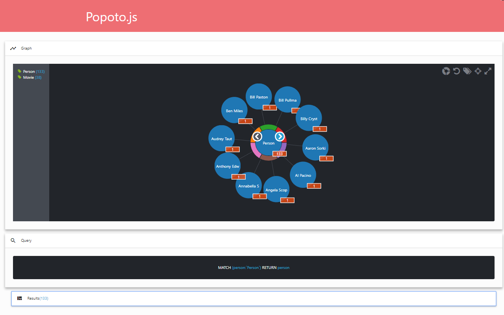

# Popoto-examples
Contains a list of Popoto.js examples

## [Auto-complete](auto-complete/readme.md)

## [Css-customization](css-customization/readme.md)

## [Cypher-viewer](cypher-viewer/readme.md)

## [Factual](factual/readme.md)

## [Fit-text](fit-text/readme.md)

## [Marker](marker/readme.md)

## [Materialize](materialize/readme.md)

## [Multiple-selection](multiple-selection/readme.md)

## [Northwind](northwind/readme.md)

## [Query-viewer](query-viewer/readme.md)

## [Reset-customization](reset-customization/readme.md)

## [Results](results/readme.md)

## [Save](save/readme.md)

## [Simple-graph](simple-graph/readme.md)

## [Start-from-schema](start-from-schema/readme.md)

## [Taxonomy](taxonomy/readme.md)

## [US-regions](us-regions/readme.md)

