# Popoto-examples
Contains a list of Popoto.js examples

<table>
    <tr valign="top">
        <td width="25%">Add-relation-event </td>
        <td width="25%">Auto-complete <a href="auto-complete/readme.md">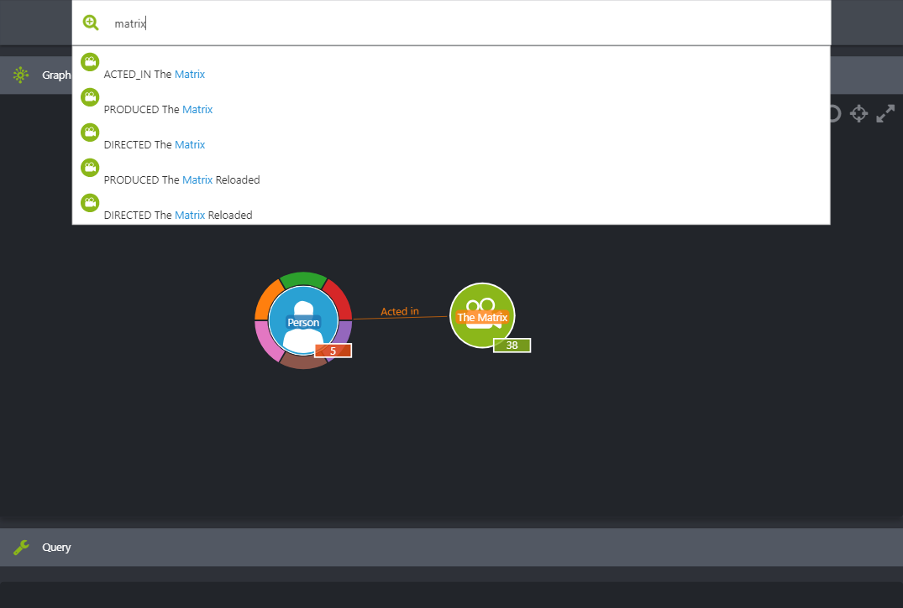</a></td>
        <td width="25%">Change-query-root <a href="change-query-root/readme.md">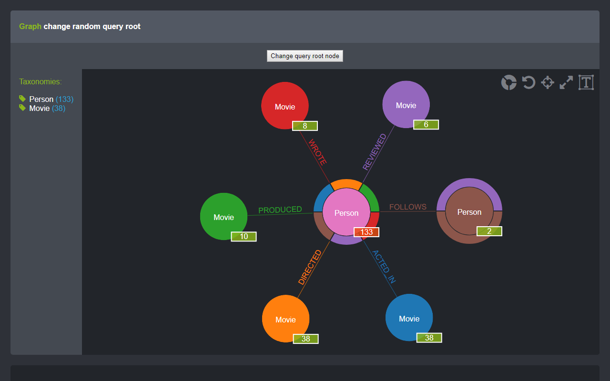</a></td>
        <td width="25%">Css-customization <a href="css-customization/readme.md">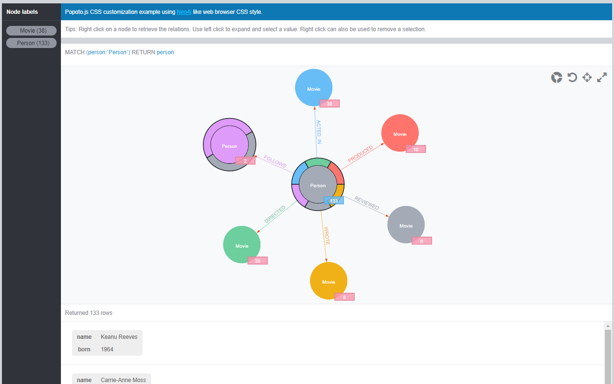</a></td>
    </tr>
    <tr valign="top">
        <td width="25%">Cypher-viewer <a href="cypher-viewer/readme.md">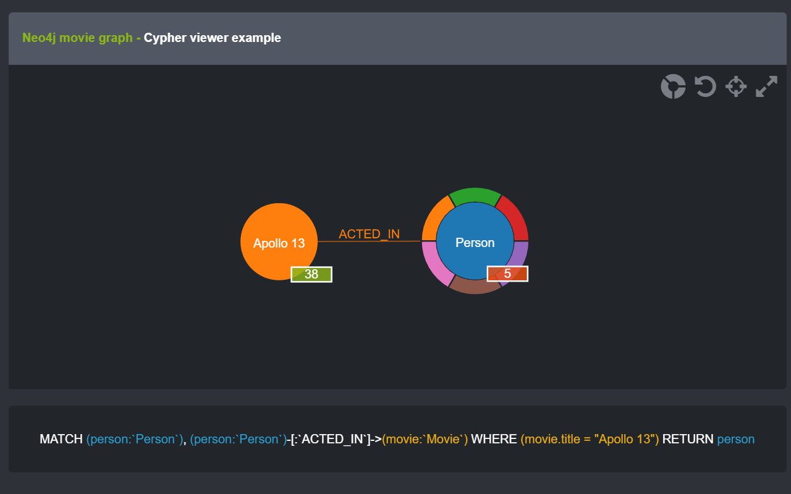</a></td>
        <td width="25%">Factual <a href="factual/readme.md">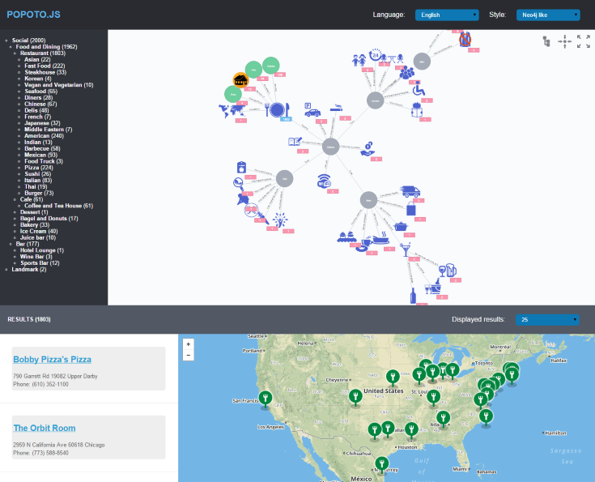</a></td>
        <td width="25%">Fit-text <a href="fit-text/readme.md">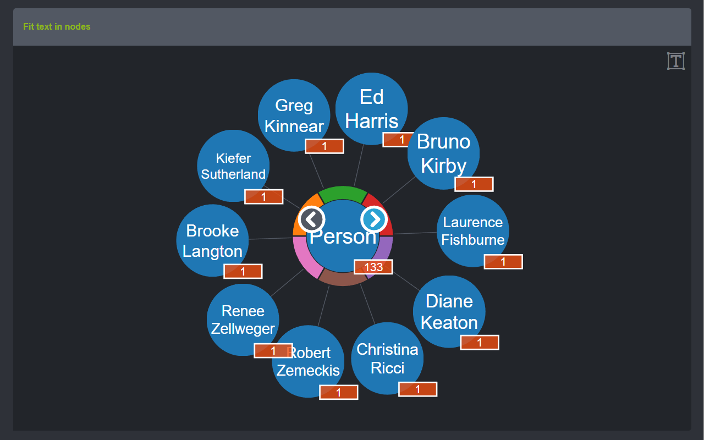</a></td>
        <td width="25%">Graph-results <a href="graph-results/readme.md">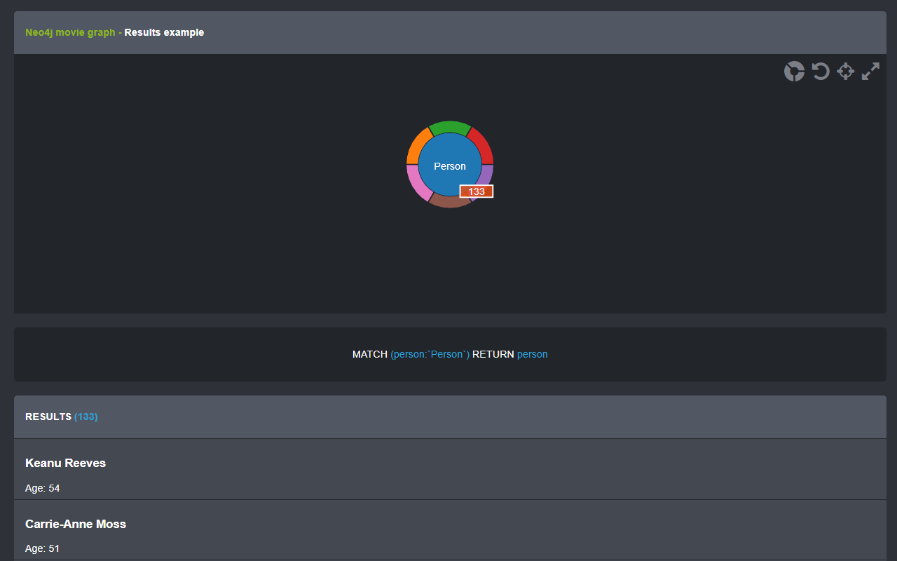</a></td>
    </tr>
    <tr valign="top">
        <td width="25%">Marker </td>
        <td width="25%">Multiple-selection <a href="multiple-selection/readme.md">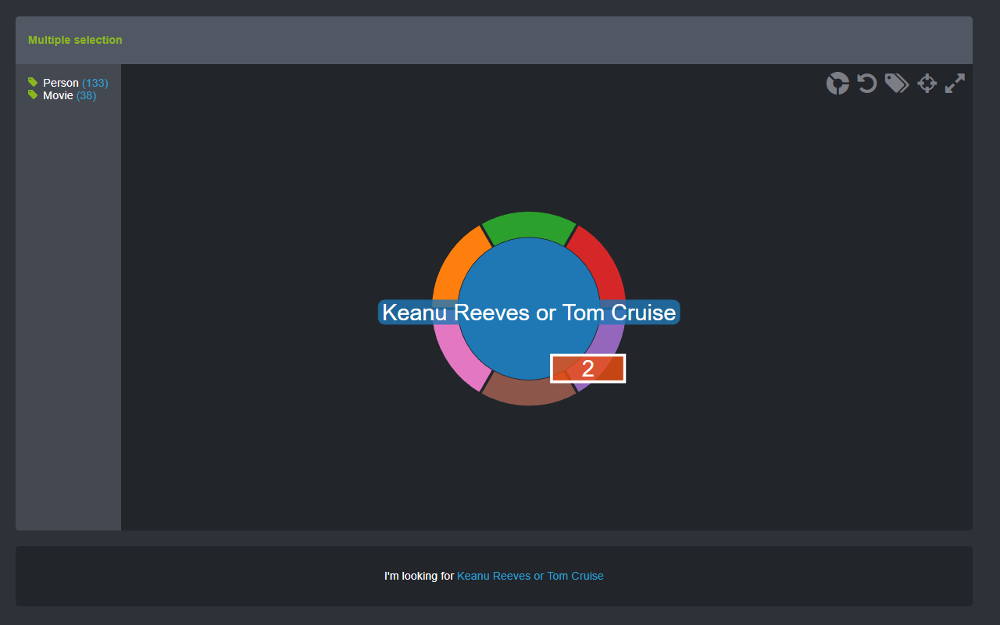</a></td>
        <td width="25%">Northwind </td>
        <td width="25%">Query-viewer <a href="query-viewer/readme.md">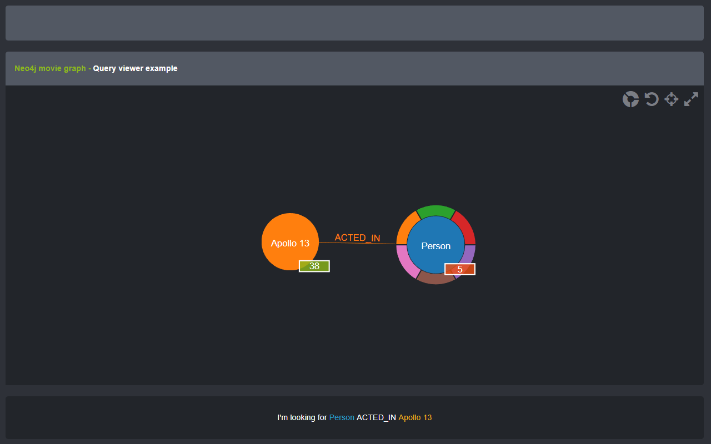</a></td>
    </tr>
    <tr valign="top">
        <td width="25%">Reset-customization </td>
        <td width="25%">Results </td>
        <td width="25%">Save <a href="save/readme.md">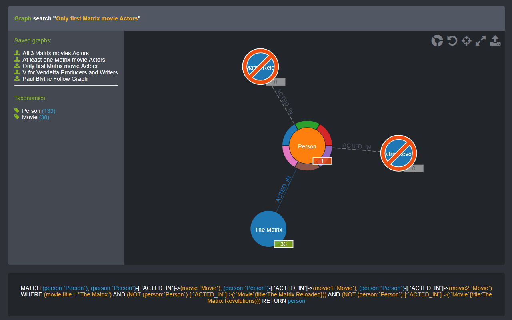</a></td>
        <td width="25%">Simple-graph <a href="simple-graph/readme.md">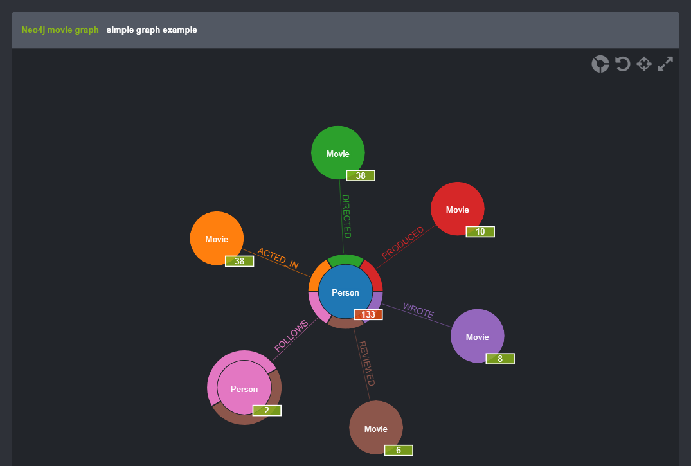</a></td>
    </tr>
    <tr valign="top">
        <td width="25%">Start-from-schema <a href="start-from-schema/readme.md">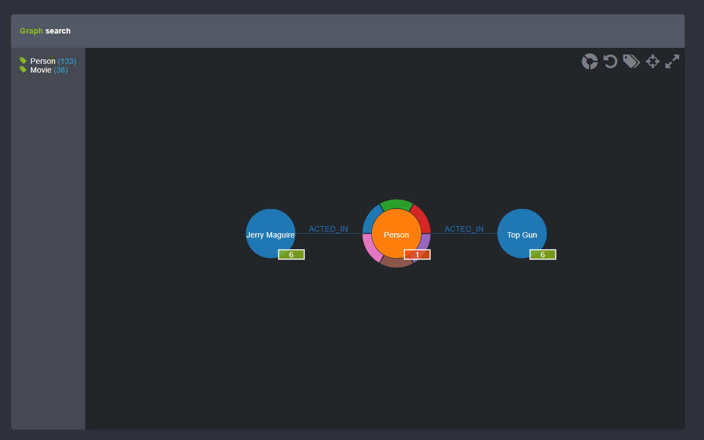</a></td>
        <td width="25%">Taxonomy <a href="taxonomy/readme.md">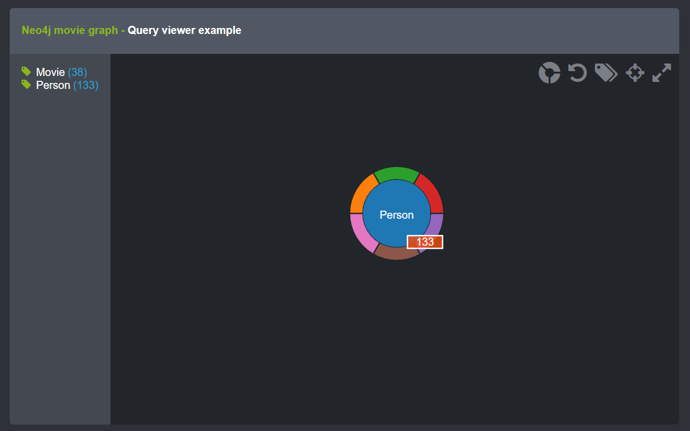</a></td>
        <td width="25%">US-regions <a href="us-regions/readme.md">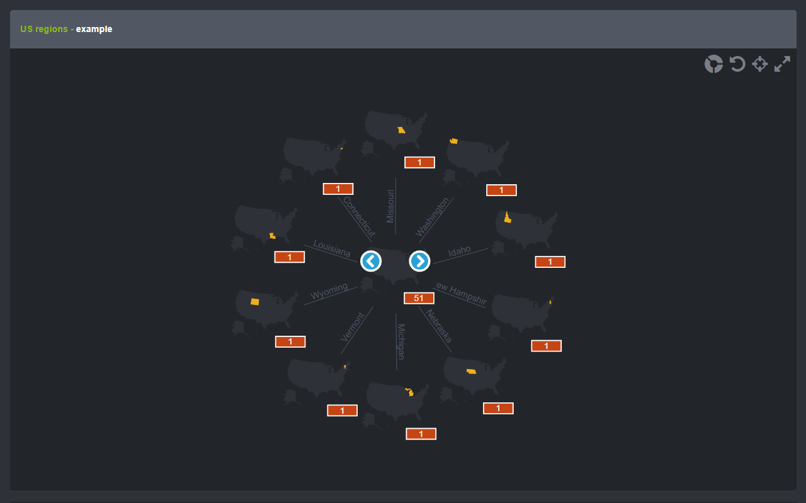</a></td>
        <td width="25%"></td>
    </tr>
</table>