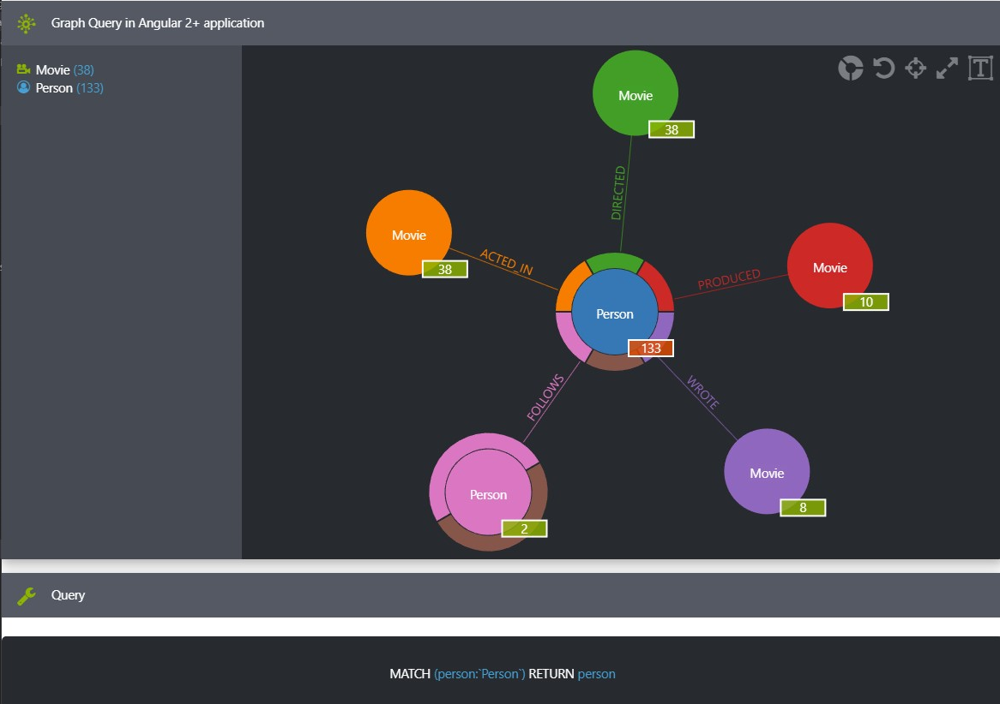
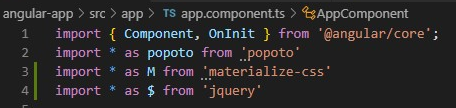
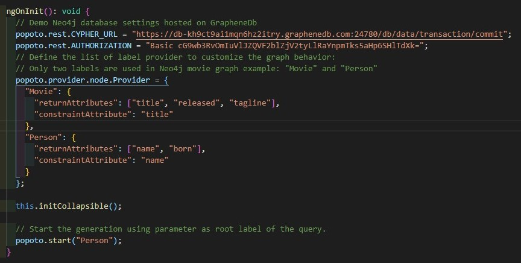
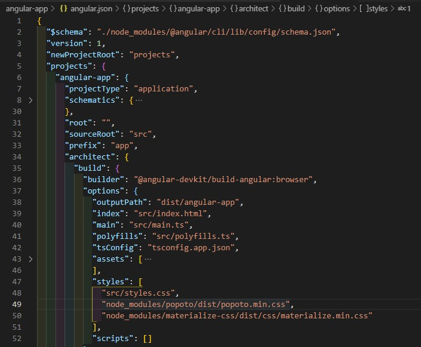

# AngularApp

Example of [Popoto.js](http://popotojs.com/) on Neo4j movie dataset in angular 2+ app.

This project was generated with [Angular CLI](https://github.com/angular/angular-cli) version 8.0.1.

## Add popoto to angular 2+ app

1. do `yarn add popoto` (or `npm i popoto`)

2. add `import * as popoto from 'popoto'` to top of `component.ts`

3. add code for initialization (config) popoto to `ngOnInit()` function (**not in `constructor`**)

4. add html template to `app.component.html`

5. add `"node_modules/popoto/dist/popoto.min.css"` to `angular.json > projects > angular-app > architect > build > options > styles` section

