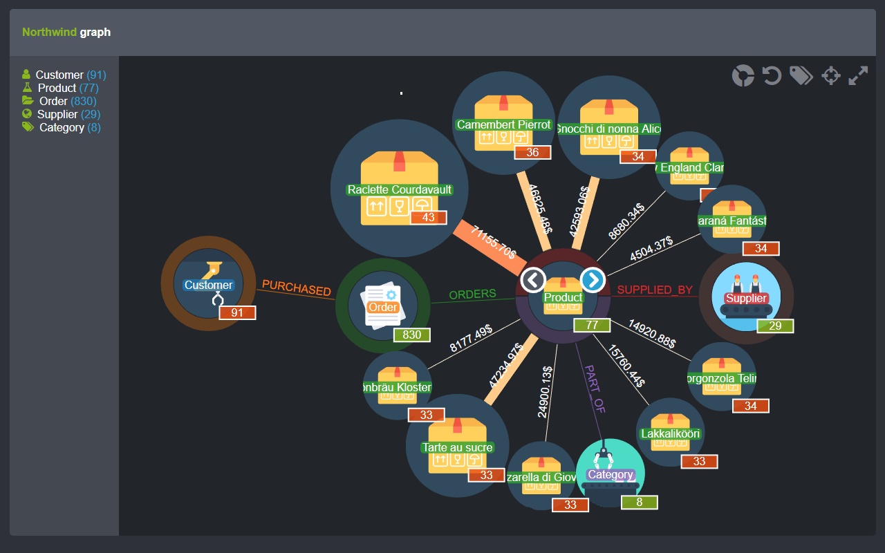

# Northwind

Popoto.js example using [Neo4j Northwind dataset](https://neo4j.com/developer/guide-importing-data-and-etl) 

[](https://nhogs.github.io/popoto-examples/northwind/index.html)

[Open live version here](https://nhogs.github.io/popoto-examples/northwind/index.html)

## Data
This example is based on [Neo4j Northwind dataset](https://neo4j.com/developer/guide-importing-data-and-etl) and can be installed on your database using the following command in the browser:
```
:play northwind graph
```
All the cypher commands can also be found in the [create.cypher](cypher/create.cypher) file.

The data schema look like this:


In this model the `-[ORDERS]->` relationship also contains properties like `quantity`, `unitPrice` and `discount`.
With these it is possible to customize the `Product` nodes and link on Popoto.

To have access to the relationships properties this property must be set to `true`.
```js
popoto.query.COLLECT_RELATIONS_WITH_VALUES = true;
```

One interesting possibility is to compute the total amount sold using `quantity` * `unitPrice` minus the discount on the list of relations.
Example of computation function: 
```js
/**
 * Compute the total amount earned based on a list of relations data.
 * The count is done by doing the sum of relation amount defined by the multiplying the quantity of product sold by the product unitPrice minus the discount.
 *
 * @param relations the list of relations data.
 * @return {string} the total amount.
 */
function relationsAmount(relations) {
    return relations.reduce(function (a, rel) {
        var relAmount = rel.quantity * parseFloat(rel.unitPrice);
        var relDiscount = rel.discount * relAmount;

        return (a + relAmount - relDiscount);
    }, 0).toFixed(2);
}
```

Using this function it is possible to customize node size for `Product` nodes by defining the `getSize` function like this:
```js
// Popoto nodes provider configuration
popoto.provider.node.Provider = {
    "Customer": {
        //...
    },
    "Product": {
        returnAttributes: ["productName", "categoryID", "discontinued", "unitsOnOrder", "quantityPerUnit", "reorderLevel", "supplierID", "unitsInStock", "productID", "unitPrice"],
        constraintAttribute: "productID",
        autoExpandRelations: true,
        "getDisplayType": function (node) {
            return popoto.provider.node.DisplayTypes.IMAGE;
        },
        "getSize": function (node) {
            if (node.type === popoto.graph.node.NodeTypes.VALUE) {
                if (node.parent.parentRel === "ORDERS") {
                    if (node.attributes.hasOwnProperty("incomingRels")) {
                        return sizeScale(relationsAmount(node.attributes.incomingRels));
                    }
                }
            }

            if (node.value !== undefined && node.value.length > 0) {
                if (node.parentRel === "ORDERS") {
                    if (node.value[0].attributes.hasOwnProperty("incomingRels")) {
                        return sizeScale(relationsAmount(node.value[0].attributes.incomingRels));
                    }
                }
            }

            return 50;
        }
    }
    //...
}
```

And to display the computed amount on links it is possible to customize the `getTextValue` in link provider like this:
```js
// Popoto links provider configuration
popoto.provider.link.Provider = {

    // Text displayed on links
    "getTextValue": function (link) {
        if (link.type === popoto.graph.link.LinkTypes.VALUE && link.source.label === "Product" && link.source.parentRel === "ORDERS") {
            if (link.target.attributes.hasOwnProperty("incomingRels")) {
                return relationsAmount(link.target.attributes.incomingRels) + "$";
            }
        }

        return popoto.provider.link.DEFAULT_PROVIDER.getTextValue(link);
    },

};
```

To customize relationship links it is possible to set a custom CSS class using the `getCSSClass` function on link provider like this:
```js
// Popoto links provider configuration
popoto.provider.link.Provider = {

    // CSS class added on svg links
    "getCSSClass": function (link, element) {
        if (link.type === popoto.graph.link.LinkTypes.VALUE && link.source.label === "Product" && link.source.parentRel === "ORDERS" && (element === "path" || element === "path--hover")) {
            if (link.target.attributes.hasOwnProperty("incomingRels")) {
                return "ppt-link__" + element + "--value " + strokeCSSScale(relationsAmount(link.target.attributes.incomingRels));
            }
        }
        return popoto.provider.link.DEFAULT_PROVIDER.getCSSClass(link, element);
    }

};
```

To scale the the size and CSS classes this example rely on D3 `scaleQuantize` function like this:
```js
// Use known min and max amount but should be extracted from data in a real application
var maxAmount = 141396;
var minAmount = 3044;

// Generate size and CSS classes scales based on data using d3.
var sizeScale = d3.scaleQuantize().domain([minAmount, maxAmount]).range([50, 75, 100, 125, 150]);
var strokeCSSScale = d3.scaleQuantize().domain([minAmount, maxAmount]).range(["very-thin", "thin", "medium", "thick", "very-thick"]);
```

The result will look like this:


With node size update after selection:

