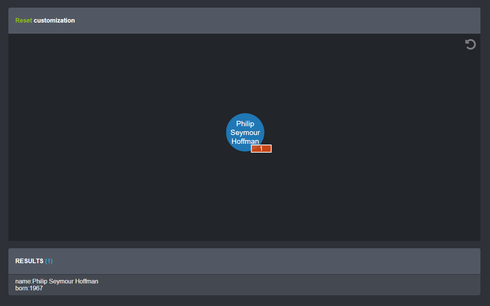

# reset-customization

Example of [Popoto.js](http://popotojs.com/) to show how to customize reset action.

[Live version here](https://nhogs.github.io/popoto-examples/reset-customization/index.html)
